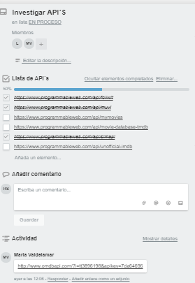
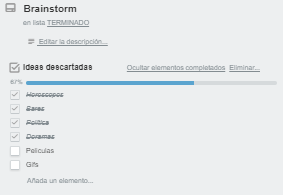
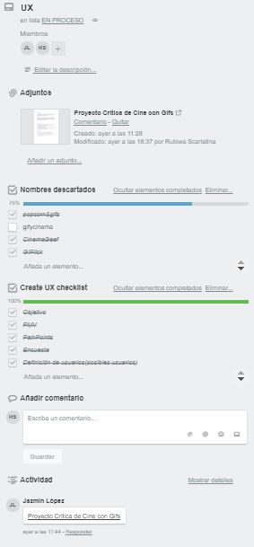

# Hackathon Entertainment

Bienvenida a la hackathon de finalización del plan común. En esta ocasión la temática será el entretenimiento y crearemos soluciones/productos utilizando un API.

********************************************************************************

## Reglas generales:

* El trabajo es en squads de 4-5 personas
* Duración: 4 turnos en la sala de clases y todo el tiempo adicional que quieran/puedan trabajar.
* Presentaciones:
  Habrán dos. Una el segundo día, mostrando avances, y otra al final mostrando el producto final
  La pauta para las presentaciones es la siguiente:
  Sé breve y anda directo al punto que quieres discutir.
  Piensa en que le hablas a un cliente, no a otra estudiante o un(a) profesor(a).
  Que lo que muestres hable por sí mismo, habla más acerca de tu proceso, de los ¿Por qué? que de los ¿Qué?
  Sé explícita, enfócate en lo que está terminado y en lo que está pendiente o en progreso.
  Deja tiempo para preguntas y respuestas.

********************************************************************************

### Recomendaciones:
* Google y el contenido en el LMS son tus mejores amigos, úsalos.
* Empieza el día de trabajo con un daily y termínalo con una retrospectiva
* Utiliza todos los conocimientos/habilidades que has adquirido en tu tiempo en Laboratoria
* Trata todo el tiempo de tomar tiempo a todas las actividades (timeboxed).
* No presentes tu solución final en localhost. Comparte un link.
* Organícense sobre cómo trabajarán en GIT.
* Prefiere siempre pocas cosas funcionando OK que muchas “a medias”.

********************************************************************************
## Propuesta
Crear un sitio web donde los hispanohablantes puedan compartir reseñas de peliculas sin pretensiones, de manera intuitiva y amigable.

#### Pain Points

* Muchos espectadores disfrutan de películas no universalmente elogiadas por la crítica, por lo que no ponen mucho énfasis en las calificaciones.

* Los sitios web orientados a nichos tienen información más detallada sobre películas y programas de televisión de un cierto género.


* La mayoría de los espectadores no siguen ningún crítico en particular y muchos rara vez leen reseñas en profundidad, si es que lo hacen.


#### Encuestas

* 45% ver reseñas o puntuaciones de la mayoría o de todas las películas que ven

* El 23% comprende con confianza el sistema de calificación Tomatometer

* El 23% consideró que las evaluaciones o calificaciones son importantes o muy importantes a la hora de decidir qué mirar


### Proceso creativo y organización

#### Brainstorming:
* Definimos el area de entretenimiento a explorar.
* Detectamos la necesidad de un sitio para criticas cinematograficas en donde no haya reseñas _pretensiosas_.  
* Diferenciador: Experiencia intuitiva. Ya que muchos sitios web de la competencia poseen herramientas con un grado de complejidad no apto para usuarios nuevos, con lo cual se tornan inconvenientes e incluso estorbosas


### Planeación.

#### Trello




### Avance día siguiente.


#### Agenda por día.
| Integrante | Martes | Miercoles | Jueves | Viernes
| ---------- | ------ | --------- | ------ | -------
| Jazmin | Brainstorming, planificación del trabajo, Ideación del proyecto, UX basics,logo y paleta de colores, git branch | Vistas | Vistas | Detalles
| Laura | Brainstorming, planificación del trabajo, Ideación del proyecto, UX basics, estructura html, APIs research, git master | Api OMDV (pelis) | Implementar API y funcionalidades | Practicas presentaciÓn
| Tony | Brainstorming, planificación del trabajo, Ideación del proyecto, UX basics, APIs research, git branch  | API OMDV (pelis)| Implementar API y funcionalidades | Practicas Presentación
| Scarlett | Brainstorming, planificación del trabajo, Ideación del proyecto, UX basics,APIS research, | Git branch, READme, recabación de información, estrategia basada en descubrimiento | Presentación | Practicas presentación.

***

### Pre-requisitos

Requiere explorador web
```
Chrome, Safari, Internet explorer...
```

## < l a b o r a t o r i a >
